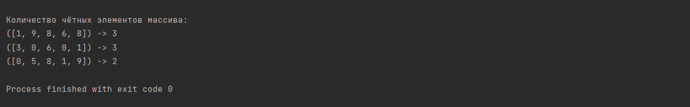
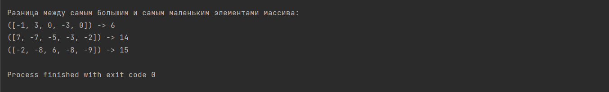
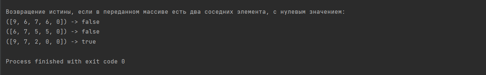

# Урок 4. Семинар: Данные и функции

## Задание 1:
Написать метод, возвращающий количество чётных элементов массива.
countEvens([2, 1, 2, 3, 4]) → 3
countEvens([2, 2, 0]) → 3
countEvens([1, 3, 5]) → 0
----------
_Демонстрация решения:_

------------------------------------------------------------------------------------------
## Задание 2:
Написать функцию, возвращающую разницу между самым большим и самым маленьким элементами 
переданного не пустого массива.
----------
_Демонстрация решения:_

------------------------------------------------------------------------------------------
## Задание 3: 
Написать функцию, возвращающую истину, если в переданном массиве есть два соседних элемента, с нулевым значением.
----------
_Демонстрация решения:_

